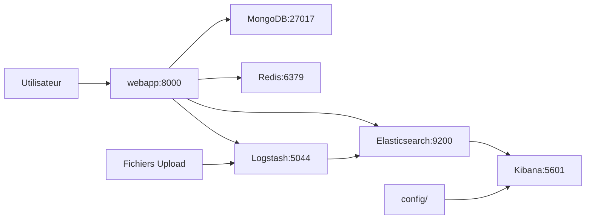

# 🏗️ Architecture du Projet - LogStream Studio

## 📊 Vue d'ensemble

LogStream Studio suit une architecture modulaire et organisée pour faciliter la maintenance et l'évolution du projet.

## 📁 Structure Complète

```
projet/
│
├── 📄 Fichiers Racine
│   ├── docker-compose.yml      # Orchestration des 7 services
│   ├── README.md               # Documentation principale
│   ├── .env                    # Variables d'environnement (git ignored)
│   ├── .env.example            # Template de configuration
│   └── .gitignore              # Fichiers exclus de Git
│
├── 📋 config/                  # Configuration et fichiers de données de test
│   ├── README.md                       # Documentation du dossier
│   ├── dashboard-final.ndjson          # Dashboard Kibana optimisé
│   ├── ecommerce-dashboard-export.ndjson
│   ├── fix-tables.ndjson               # Configuration tables Kibana
│   ├── fix-visualizations.ndjson       # Configuration visualisations
│   ├── kibana-import-pro.ndjson        # Import Kibana professionnel
│   ├── kibana-import.ndjson            # Import Kibana basique
│   ├── test-ecommerce-logs.json        # Données de test e-commerce
│   └── test-mongo.csv                  # Données de test MongoDB
│
├── 💾 data/                    # Données persistantes (volumes Docker)
│   ├── elasticsearch/          # Index et données Elasticsearch
│   ├── kibana/                 # Configuration Kibana persistante
│   ├── logstash/               # Queue et dead letter queue
│   ├── mongodb/                # Base de données MongoDB
│   ├── redis/                  # Snapshots Redis (dump.rdb)
│   └── uploads/                # Fichiers uploadés par les utilisateurs
│
├── 📚 docs/                    # Documentation complète du projet
│   ├── README.md                       # Index de la documentation
│   │
│   ├── 🔐 Authentification
│   │   ├── AUTH-SYSTEM.md              # Documentation JWT
│   │   ├── CHANGELOG-AUTH.md           # Changelog authentification
│   │   ├── CREDENTIALS.md              # Identifiants par défaut
│   │   └── RECAP-AUTH.md               # Récapitulatif complet
│   │
│   ├── 🎨 Design
│   │   ├── DESIGN.md                   # Design system
│   │   └── DARK-THEME.md               # Documentation thème sombre
│   │
│   ├── 📊 Fonctionnalités
│   │   ├── DATABASE-MODULE.md          # Module MongoDB/Redis
│   │   ├── KIBANA-DASHBOARD.md         # Dashboards Kibana
│   │   └── SEARCH-PAGE.md              # Page de recherche
│   │
│   └── 📝 Historique
│       ├── CHANGELOG-DASHBOARD.md      # Changelog dashboard
│       └── PHASE5-COMPLETE.md          # Historique Phase 5
│
├── ⚙️ elasticsearch/          # Configuration Elasticsearch
│   └── logs-saas-template.json # Template d'index personnalisé
│
├── 🔄 pipeline/               # Pipelines Logstash
│   ├── csv-pipeline.conf       # Pipeline pour fichiers CSV
│   └── json-pipeline.conf      # Pipeline pour fichiers JSON
│
├── 🔧 scripts/                # Scripts utilitaires
│   ├── README.md                       # Documentation des scripts
│   │
│   ├── 🧪 Tests
│   │   ├── test-services.sh            # Test tous les services
│   │   ├── test-auth-system.py         # Test authentification
│   │   └── verify-kibana-setup.sh      # Vérification Kibana
│   │
│   ├── 📊 Injection de données
│   │   ├── inject-service-logs.py      # Injection logs services
│   │   ├── inject-ecommerce-data.sh    # Injection données e-commerce
│   │   └── add-service-logs.py         # Ajout logs supplémentaires
│   │
│   ├── 🔄 Maintenance
│   │   ├── update-logs-service.py      # Mise à jour logs
│   │   ├── fill-empty-fields.py        # Remplissage champs vides
│   │   └── regenerate-customer-data.sh # Régénération données clients
│   │
│   └── ⚙️ Configuration Kibana
│       ├── setup-kibana-dashboard.sh   # Setup automatique dashboard
│       └── fix-kibana-dashboard.sh     # Réparation dashboard
│
└── 🌐 webapp/                 # Application Web Flask
    ├── app.py                  # Application Flask principale
    ├── auth.py                 # Module d'authentification JWT
    ├── database.py             # Module base de données
    ├── Dockerfile              # Image Docker webapp
    ├── requirements.txt        # Dépendances Python
    │
    ├── models/                 # Modèles de données
    │   └── __init__.py
    │
    ├── routes/                 # Routes API
    │   └── __init__.py
    │
    ├── static/                 # Ressources statiques
    │   └── style.css           # Stylesheet principal (dark theme)
    │
    ├── templates/              # Templates HTML Jinja2
    │   ├── index.html          # Dashboard principal
    │   ├── login.html          # Page de connexion
    │   ├── upload.html         # Page d'upload
    │   ├── dashboard.html      # Dashboard monitoring
    │   ├── health.html         # Health check services
    │   └── search.html         # Recherche avancée logs
    │
    └── utils/                  # Fonctions utilitaires
```

## 🎯 Principes d'Organisation

### 1. Séparation des Responsabilités
- **`config/`** : Fichiers de configuration statiques
- **`data/`** : Données dynamiques et persistantes
- **`docs/`** : Documentation technique
- **`scripts/`** : Automatisation et maintenance
- **`webapp/`** : Code applicatif

### 2. Documentation Proche du Code
Chaque dossier principal contient un `README.md` :
- `config/README.md` - Guide des fichiers de configuration
- `docs/README.md` - Index de toute la documentation
- `scripts/README.md` - Documentation des scripts utilitaires

### 3. Git-Friendly
```gitignore
# Données persistantes (ignorées)
data/

# Variables d'environnement (ignorées)
.env

# Cache Python (ignoré)
__pycache__/
*.pyc
```

## 🔄 Flux de Données



## 📦 Services Docker

| Service | Port | Volume | Configuration |
|---------|------|--------|---------------|
| **webapp** | 8000 | `./webapp:/app` | `webapp/` |
| **elasticsearch** | 9200 | `./data/elasticsearch` | `elasticsearch/` |
| **kibana** | 5601 | `./data/kibana` | `config/*.ndjson` |
| **logstash** | 5044 | `./data/logstash` | `pipeline/` |
| **mongodb** | 27017 | `./data/mongodb` | `.env` |
| **redis** | 6379 | `./data/redis` | `.env` |
| **mongo-express** | 8081 | - | `.env` |

## 🔐 Sécurité

### Fichiers Sensibles (Git Ignored)
- `.env` - Variables d'environnement
- `data/` - Données persistantes avec credentials
- `webapp/__pycache__/` - Cache Python

### Fichiers Publics (Git Tracked)
- `.env.example` - Template sans secrets
- `docs/` - Documentation
- `config/` - Configurations (pas de secrets)
- `scripts/` - Scripts automatisation

## 🚀 Workflows de Développement

### Démarrage Initial
```bash
# 1. Cloner le projet
git clone <repo>
cd projet

# 2. Configuration
cp .env.example .env
nano .env  # Éditer les variables

# 3. Démarrage
docker compose up -d

# 4. Test
./scripts/test-services.sh
```

### Développement
```bash
# Modifier le code
nano webapp/app.py

# Redémarrer le service
docker compose restart webapp

# Voir les logs
docker compose logs -f webapp
```

### Injection de Données
```bash
# Données de test
python3 scripts/inject-service-logs.py

# E-commerce
./scripts/inject-ecommerce-data.sh

# Configuration Kibana
./scripts/setup-kibana-dashboard.sh
```

### Tests
```bash
# Test des services
./scripts/test-services.sh

# Test authentification
python3 scripts/test-auth-system.py

# Test Kibana
./scripts/verify-kibana-setup.sh
```

## 📊 Statistiques du Projet

### Code Source
- **Python** : ~2,500 lignes (webapp/, scripts/)
- **HTML/CSS** : ~3,000 lignes (templates/, static/)
- **JavaScript** : ~1,000 lignes (inline dans templates)
- **Configuration** : ~500 lignes (pipelines, docker-compose)

### Documentation
- **Fichiers** : 12 fichiers Markdown
- **Mots** : ~30,000 mots
- **Pages** : ~150 pages (équivalent)

### Scripts
- **Python** : 7 scripts utilitaires
- **Bash** : 6 scripts shell
- **Tests** : 2 scripts de test automatique

## 🎓 Best Practices Appliquées

### ✅ Architecture
- [x] Séparation claire des responsabilités
- [x] Structure modulaire et évolutive
- [x] Documentation complète et organisée
- [x] Volumes Docker pour la persistance
- [x] Variables d'environnement pour la config

### ✅ Sécurité
- [x] Fichiers sensibles dans `.gitignore`
- [x] Authentification JWT pour l'admin
- [x] Cookies HTTP-only
- [x] Variables d'environnement pour secrets
- [x] Template `.env.example` sans secrets

### ✅ Maintenance
- [x] Scripts automatisés pour les tâches répétitives
- [x] Tests automatiques des services
- [x] Documentation à jour
- [x] README dans chaque dossier principal
- [x] Changelogs pour suivre l'évolution

### ✅ Développement
- [x] Hot-reload pour le développement
- [x] Logs accessibles via Docker
- [x] Health checks pour tous les services
- [x] Scripts de démarrage rapide
- [x] Données de test disponibles

## 🔄 Évolution et Scalabilité

### Structure Extensible
L'architecture permet facilement d'ajouter :
- Nouveaux services Docker dans `docker-compose.yml`
- Nouvelles routes dans `webapp/routes/`
- Nouveaux modèles dans `webapp/models/`
- Nouveaux scripts dans `scripts/`
- Nouvelle documentation dans `docs/`

### Modularité
Chaque composant est indépendant :
- Module auth (`webapp/auth.py`)
- Module database (`webapp/database.py`)
- Pipelines Logstash séparés (CSV/JSON)
- Scripts utilitaires isolés

## 📚 Ressources

### Documentation Principale
- `/README.md` - Guide de démarrage
- `/docs/README.md` - Index documentation complète

### Guides Spécifiques
- `/docs/AUTH-SYSTEM.md` - Authentification
- `/docs/DESIGN.md` - Design system
- `/docs/DATABASE-MODULE.md` - Bases de données
- `/docs/KIBANA-DASHBOARD.md` - Dashboards

### Scripts Utilitaires
- `/scripts/README.md` - Documentation des scripts

---

**LogStream Studio** ⚡ - Architecture propre, modulaire et scalable
