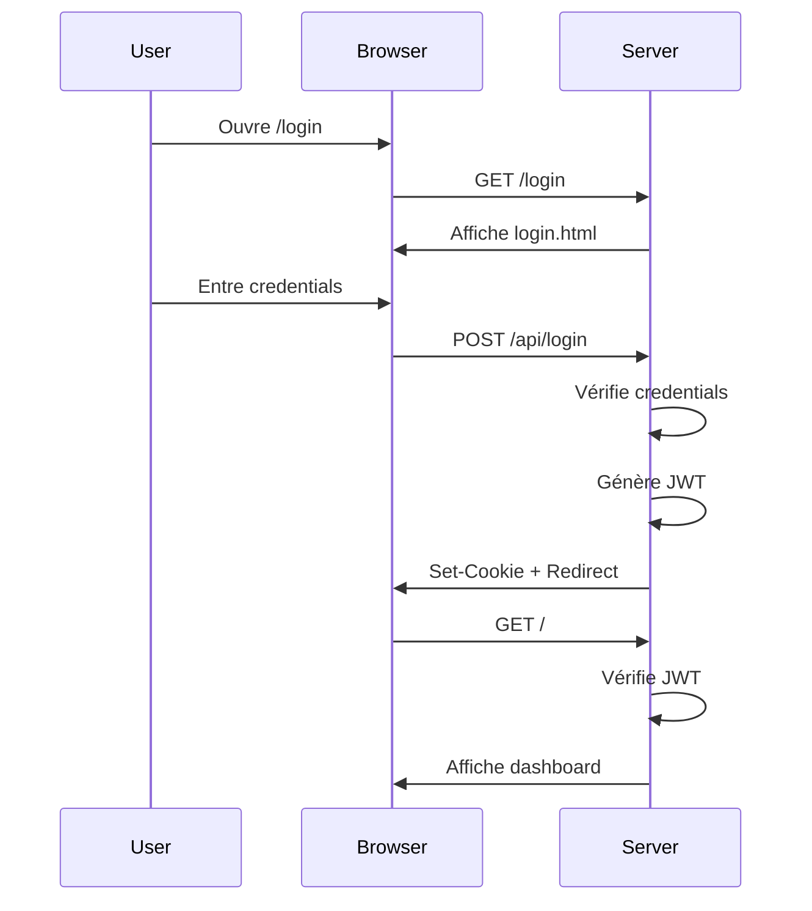
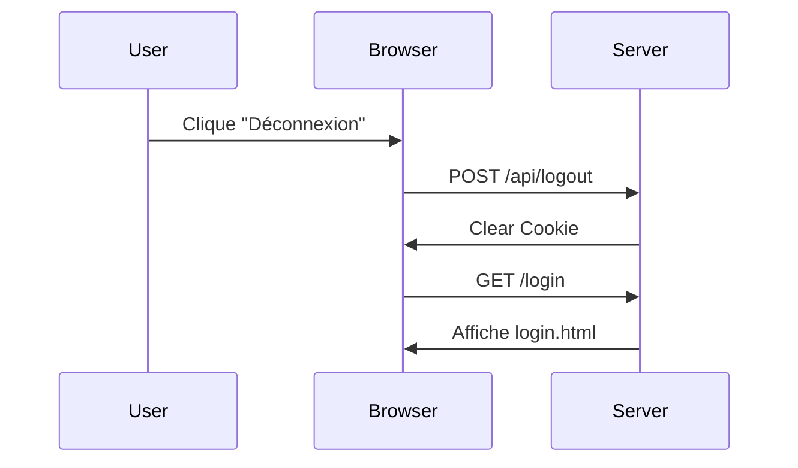

# 🔐 Système d'Authentification JWT - LogStream Studio

## Vue d'ensemble

LogStream Studio implémente un système d'authentification sécurisé basé sur JWT (JSON Web Tokens) pour protéger l'accès à l'interface d'administration. Le système est conçu pour un administrateur unique sans gestion de rôles complexe.

## Architecture

### Composants principaux

1. **Module d'authentification** (`webapp/auth.py`)
   - Classe `AuthManager` pour la gestion des tokens JWT
   - Décorateurs pour protéger les routes
   - Fonctions de vérification des credentials

2. **Interface de connexion** (`webapp/templates/login.html`)
   - Page de connexion moderne et sécurisée
   - Validation côté client
   - Gestion d'erreurs élégante

3. **Routes API**
   - `/api/login` - Authentification
   - `/api/logout` - Déconnexion
   - `/api/verify-token` - Vérification du token

## Fonctionnalités

### 🔑 Authentification par JWT

- **Algorithme**: HS256 (HMAC avec SHA-256)
- **Expiration**: 24 heures par défaut (configurable)
- **Stockage**: Cookies HTTP-only (protection XSS)
- **Support**: Authorization header et cookies

### 🔒 Sécurité

- **Hachage des mots de passe**: Werkzeug PBKDF2-SHA256
- **Cookies sécurisés**: 
  - `httponly=True` (protection XSS)
  - `samesite='Lax'` (protection CSRF)
  - `secure=True` en production (HTTPS uniquement)
- **Variables d'environnement**: Credentials non hardcodés

### ⏰ Gestion de session

- **Remember me**: Extension du cookie à 30 jours
- **Expiration token**: Configurable via `JWT_EXPIRATION_HOURS`
- **Vérification**: Token vérifié à chaque requête protégée

## Configuration

### Variables d'environnement

Créez un fichier `.env` à partir de `.env.example`:

```bash
cp .env.example .env
```

Variables essentielles:

```dotenv
# Clé secrète JWT (OBLIGATOIRE - changer en production)
JWT_SECRET_KEY=your-secret-key-change-this-in-production

# Durée d'expiration des tokens en heures
JWT_EXPIRATION_HOURS=24

# Identifiants de l'administrateur
ADMIN_USERNAME=admin
ADMIN_PASSWORD=admin123
```

⚠️ **Important**: En production, utilisez:
- Une clé secrète forte et aléatoire (32+ caractères)
- Un mot de passe administrateur complexe
- Variables stockées de manière sécurisée

### Génération d'une clé secrète

```python
import secrets
print(secrets.token_hex(32))
```

## API d'authentification

### POST /api/login

Authentifie un utilisateur et génère un token JWT.

**Requête**:
```json
{
  "username": "admin",
  "password": "admin123",
  "remember": false
}
```

**Réponse succès (200)**:
```json
{
  "message": "Connexion réussie",
  "user": {
    "username": "admin"
  }
}
```

**Réponse erreur (401)**:
```json
{
  "error": "Identifiants invalides"
}
```

**Cookie défini**:
```
Set-Cookie: access_token=<JWT>; HttpOnly; SameSite=Lax; Max-Age=86400
```

### POST /api/logout

Déconnecte l'utilisateur en supprimant le cookie.

**Réponse (200)**:
```json
{
  "message": "Déconnexion réussie"
}
```

### GET /api/verify-token

Vérifie la validité du token actuel.

**Réponse succès (200)**:
```json
{
  "valid": true,
  "user": {
    "username": "admin"
  }
}
```

**Réponse token invalide (401)**:
```json
{
  "valid": false,
  "error": "Token invalide ou expiré"
}
```

## Utilisation dans le code

### Protéger une route HTML

```python
from auth import login_required

@app.route('/dashboard')
@login_required
def dashboard():
    return render_template('dashboard.html')
```

### Protéger une route API

```python
from auth import api_login_required

@app.route('/api/stats')
@api_login_required
def api_stats():
    return jsonify({'data': 'protected'})
```

### Obtenir l'utilisateur courant

```python
from auth import get_current_user

@app.route('/profile')
@login_required
def profile():
    user = get_current_user()
    return render_template('profile.html', user=user)
```

### Vérifier l'authentification dans les templates

```html
<!-- Vérification d'authentification -->

    <p>Utilisateur connecté: {{ get_current_user() }}</p>

    <p>Non connecté</p>

```

## Routes protégées

Toutes les routes suivantes nécessitent une authentification:

### Routes HTML
- `/` - Dashboard principal
- `/health` - Health check
- `/search` - Recherche de logs
- `/upload` - Upload de fichiers
- `/dashboard` - Dashboard de monitoring

### Routes API
- `/api/health` - Statut des services
- `/api/stats` - Statistiques
- `/api/search` - Recherche dans les logs
- `/api/upload` - Upload de fichiers (POST)

### Routes publiques
- `/login` - Page de connexion
- `/api/login` - Authentification (POST)
- `/api/logout` - Déconnexion (POST)
- `/api/verify-token` - Vérification token

## Flux d'authentification

### Connexion



### Déconnexion



## Sécurité avancée

### Bonnes pratiques implémentées

✅ Hachage des mots de passe avec PBKDF2-SHA256  
✅ Cookies HTTP-only contre XSS  
✅ SameSite=Lax contre CSRF  
✅ Expiration des tokens  
✅ Variables d'environnement pour les secrets  
✅ Validation côté serveur  
✅ Messages d'erreur génériques (pas de leak d'info)

### Améliorations futures possibles

- Rate limiting sur `/api/login`
- Logs d'authentification
- Blacklist de tokens révoqués (Redis)
- Refresh tokens
- 2FA (authentification à deux facteurs)
- Politique de mots de passe complexes

## Tests

### Test manuel

1. Démarrer l'application:
```bash
docker compose up --build
```

2. Accéder à `http://localhost:8000`
3. Vous serez redirigé vers `/login`
4. Se connecter avec `admin` / `admin123`
5. Vérifier l'accès au dashboard
6. Cliquer sur "Déconnexion"
7. Vérifier la redirection vers `/login`

### Test programmatique

Le fichier `auth.py` contient des fonctions de test:

```python
python webapp/auth.py
```

Sortie attendue:
```
✓ Vérification des credentials - Succès
✓ Génération du token - Succès
✓ Vérification du token - Succès
✓ Token expiré - Succès
✓ Token invalide - Succès
```

## Dépendances

```txt
PyJWT==2.8.0          # Génération et validation JWT
Werkzeug==2.3.6       # Hachage de mots de passe
Flask==2.3.2          # Framework web
```

## Troubleshooting

### Erreur: "Token invalide ou expiré"
- Vérifiez que `JWT_SECRET_KEY` est définie
- Vérifiez que la clé n'a pas changé entre deux redémarrages
- Supprimez les cookies du navigateur

### Erreur: "Identifiants invalides"
- Vérifiez les variables `ADMIN_USERNAME` et `ADMIN_PASSWORD`
- Assurez-vous que le fichier `.env` est chargé

### Redirection infinie
- Vérifiez que les cookies sont acceptés dans le navigateur
- Vérifiez la configuration `SameSite` des cookies

### Route non protégée
- Assurez-vous d'utiliser le bon décorateur:
  - `@login_required` pour HTML
  - `@api_login_required` pour API
- Le décorateur doit être juste avant la définition de fonction

## Support

Pour plus d'informations sur JWT:
- Documentation PyJWT: https://pyjwt.readthedocs.io/
- JWT.io: https://jwt.io/

---

**LogStream Studio** ⚡ - Monitoring de logs sécurisé et performant
